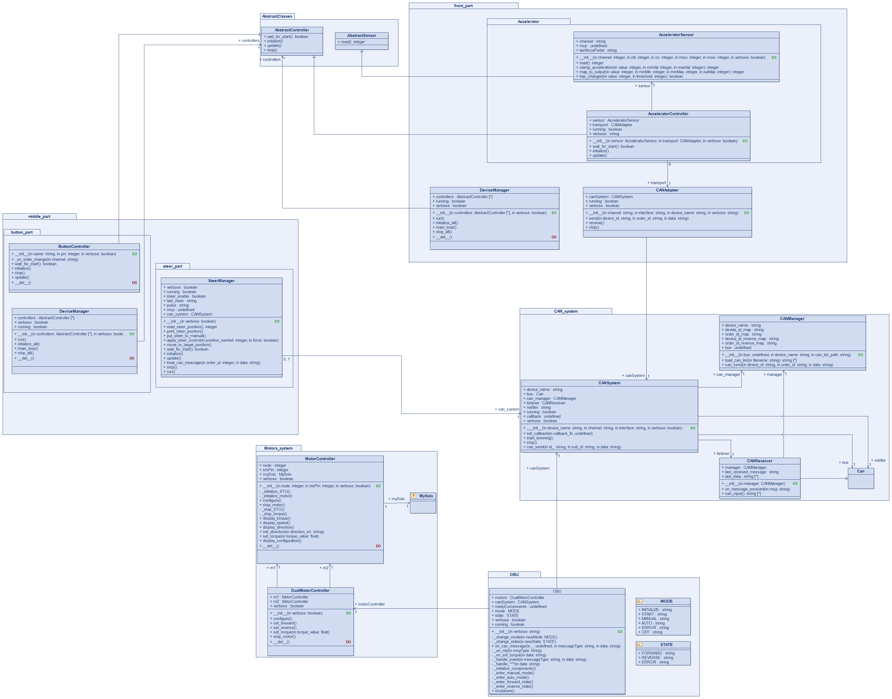
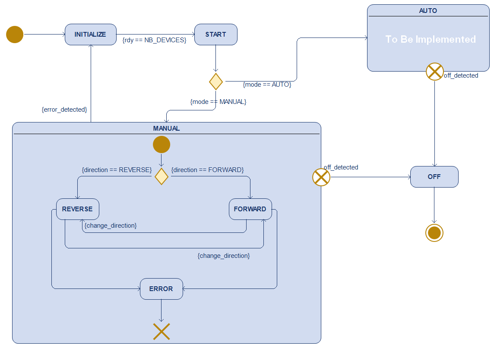

# control-vacop

## Table of Contents

1. [Document overview](#document-overview)  
2. [Overall project structure](#overall-project-structure)
   -[Based on previous project](#based-on-previous-project)  
3. [CAN_system part](#can_system-part)  
4. [back_part section](#back_part-section)  
   - [Starting the back section](#starting-the-back-section)  
   - [Important notes](#important-notes)  
5. [middle_part section](#middle_part-section)  
   - [Starting the central section](#starting-the-central-section)  
6. [front_part section](#front_part-section)  
   - [Starting the front section](#starting-the-front-section)  
7. [Adding a component to the project](#adding-a-component-to-the-project)  
8. [Raspberry Pi configuration for CAN](#raspberry-pi-configuration-for-can)  
9. [Possible improvements](#possible-improvements)  
10. [Appendices](#appendices)  
    - [Class diagram – VACOP system](#class-diagram--vacop-system)  
    - [State Machine Diagram](#state-machine-diagram)  
11. [Licence](#licence)  
12. [Contact](#contact)


## Document overview
This project implements communication between three Raspberry Pis embedded in the VACOP system via the CAN bus to manage the motors, accelerator, steering, and dashboard controls.
It is based on :

- [python-can](https://github.com/hardbyte/python-can) : handling the low-level CAN layer

- [SoloPy](https://github.com/Solo-FL/SoloPy) : CANopen communication with Solo Mega motors

### Based on previous project

This project builds on a previous VACOP system prototype :
[Code-Vacop GitHub Repository](https://github.com/Rmyard/Code-Vacop)

The original project introduced the core concept of communication between multiple Raspberry Pi boards via the CAN bus. It also implemented motor control logic, steering, and dashboard interaction.

The current version refactors and extends that work with :
- A clearer separation of concerns between hardware roles (front/middle/back).
- A robust and modular CAN communication layer using `CANSystem`.
- Improved configuration and deployment scripts for reproducible setups.
- Enhanced abstraction of devices via the `AbstractController` interface.


## Overall project structure

The project is divided into 3 functional blocks, each running on a specific Raspberry Pi :

- `back_part/` : manages the motors and the OBU (the main controller of the project)
- `middle_part/` : manages the dashboard buttons and steering
- `front_part/` : reads sensors and driver controls (accelerator)

## CAN\_system part

This section handles the overall management of the CAN bus.

- `CANSystem.py` : contains classes and functions for sending/receiving standard CAN messages.

- `CANSystem_p.py` : a variant that uses a priority queue to manage CAN messages.
  Messages are processed based on their priority rather than their arrival order. (Used for the OBU)

- `can_list.txt` : list of CAN IDs used in the VACOP system, providing clear documentation of exchanged messages.


## back\_part section

This folder manages the rear Raspberry Pi.
It controls the motors via the SoloPy library (CANopen) and acts as the main motor control unit (OBU).

- `OBU.py` : main entry point of the rear Raspberry Pi. Handles receiving CAN commands and controls the motors through the following classes.

- `MotorController.py` : low-level interface for individual motor control using SoloPy.

- `MotorController_test.py` : test script to validate proper motor functionality.

- `DualMotorController.py` : orchestrates simultaneous control of both motors (left + right).

- `back_setup.sh` : environment initialization script (CAN configuration, Python dependencies).

### Starting the back section

Before running the files, the Raspberry Pi must have its configuration enabled (see the [Raspberry Pi CAN Configuration](#raspberry-pi-configuration-for-can) section).

There are two ways to start the OBU :

#### Manually :

```bash
sudo ip link set can0 up type can bitrate 1000000
source solopy-env/bin/activate
```

#### Automatically :

```bash
cd back_part\
source back_setup.sh
```

Then, from the root folder, simply launch the OBU with :

```bash
python3 -m back_part.OBU -v
```

### Important notes :

This repository uses a **modified version of SoloPy (2025)**.
The modifications include :
In `SoloPy/MCP2515.py` → method `can_transmit` :

```python
if not information_received :
    result = False
    error = Error.GENERAL_ERROR
    return result, error
```

If needed, to allow configuration of the Solo motors via the [Motion Terminal](https://www.solomotorcontrollers.com/SOLO-motion-terminal/2.9.1/) :

[`SOLO-WorkSpace[2025-07-08_10-30].solows`](./docs/SOLO-WorkSpace[2025-07-08_10-30].solows)

You can load this file using the motor terminal provided by Solo-FL to **calibrate the motors**.

> ⚠️ This file is **specific to the motors** used in this project.
> If you are not using the same motors, please refer to this link :
> [https://www.solomotorcontrollers.com/blog/hall-sensors-to-solo-for-controlling-speed-torque-brushless-motor/](https://www.solomotorcontrollers.com/blog/hall-sensors-to-solo-for-controlling-speed-torque-brushless-motor/)


## middle\_part section

Manages the controls on the central Raspberry Pi of the VACOP system.
This part serves as the driver interface: steering wheel, buttons, indicators, headlights, etc.

- `button_part/` : management of the physical dashboard buttons :

  - `ButtonController.py` : reads GPIO inputs from buttons and sends events via CAN
  - `DeviceManager.py` : identifies and configures available buttons at startup

- `steer_part/` : steering management :

  - `SteerManager.py` : reads the steering wheel position and sends steering commands to the rear Raspberry Pi via CAN

- `middle_setup.sh` : setup script for the central Raspberry Pi (CAN initialization, etc.)

### Starting the central section

Before running the files, the Raspberry Pi must have its configuration enabled (see the [Raspberry Pi CAN Configuration](#raspberry-pi-configuration-for-can) section).

There are two ways to start this part :

#### Manually :

```bash
sudo ip link set can0 up type can bitrate 1000000
```

#### Automatically :

```bash
cd middle_part\
source middle_setup.sh
```

Then, from the root folder, simply launch the following in two separate terminals:

```bash
python3 -m middle_part.DeviceManager -v
```

```bash
python3 -m middle_part.SteerManager -v
```

## front\_part section

Manages the accelerator (located on the front Raspberry Pi).
This Raspberry Pi reads the accelerator sensor data and sends it via CAN.

- `CANAdapter.py` : adapts the CAN interface for sending data to the OBU.
- `DeviceManager.py` : initializes and manages devices connected to the front Raspberry Pi.
- `accelerator/` :

    - `sensor.py` : raw reading of the accelerator sensor data (potentiometer).
    - `controller.py` : converts the raw values into usable commands (acceleration, engine braking, etc.).
- `front_setup.sh` : configuration script to initialize the front Raspberry Pi.

### Starting the front section

Before running the files, the Raspberry Pi must have its configuration enabled (see the [Raspberry Pi CAN Configuration](#raspberry-pi-configuration-for-can) section).

There are two ways to start this part :

#### Manually :

```bash
sudo ip link set can0 up type can bitrate 1000000
```

#### Automatically :

```bash
cd front_part\
source front_setup.sh
```

Then, from the root folder, simply launch in a terminal :

```bash
python3 -m front_part.DeviceManager -v
```

## Adding a component to the project

To add a new component, whether on the front or rear Raspberry Pi, you need to :

1. **Create a class for your new device** by inheriting from the abstract class `AbstractController` defined in [`AbstractClasses.py`](./AbstractClasses.py).

2. **Implement all the abstract methods** required by `AbstractController` so your class can be properly handled.

3. **Register your new device** dynamically in the corresponding `DeviceManager` by adding it to the list of controllers passed as a parameter during initialization.

This structure ensures that your new component integrates seamlessly with the existing system and communicates correctly via CAN.


## Raspberry Pi configuration for CAN

To enable CAN communication via the MCP2515 controller, edit the configuration file :

```bash
sudo nano /boot/config.txt
```

Add or modify the following lines :

```bash
...
dtparam=spi=on
dtoverlay=mcp2515-can0,oscillator=16000000,interrupt=25,spimaxfrequency=10000000
...
```

These settings enable the SPI interface and configure the MCP2515 CAN module, which is required for communication between the Raspberry Pis in the VACOP system.

## Possible improvements
Some potential enhancements to the VACOP system include :
- Unifying the management of steering and dashboard buttons into a single DeviceManager for simplified control and maintenance.
- Implementing automatic startup scripts to launch the Raspberry Pis and their respective processes seamlessly on boot.
- Developing dedicated control functionality for the brake pedal to enhance overall vehicle handling and safety.

## Appendices

### Class diagram – VACOP system
The following appendix presents the class diagram of the VACOP project, providing a structural overview of the main components, their relationships, and the data flows between modules.

<p align="center">
  
</p>

### State Machine Diagram

Within the VACOP system, the management of the different operating phases is handled by a finite state machine (FSM) implemented at the level of the OBU.

This machine organizes the OBU’s behavior based on received commands, sensor inputs, and various events on the CAN bus.

Each state corresponds to a specific system condition, and transitions between states occur according to inputs and events, ensuring precise, safe, and orderly control of operations.

<p align="center">
  
</p>

The VACOP system uses two distinct types of states :

* **Modes** : represent the main operating modes of the system :

  * INITIALIZE : startup phase with system checks and component initialization.
  * START : preparation mode before full operation with additional checks.
  * MANUAL : manual driving mode with direct user control.
  * AUTO : automatic mode with autonomous command handling.
  * OFF : system off or standby without active control.

* **States** : indicate the current condition or direction within a mode :

  * REVERSE : vehicle is reversing, motors’ direction is inverted.
  * ERROR : an anomaly is detected, system restricts operations for safety.
  * FORWARD : vehicle moving forward, motors running normally.

## Licence

**control-vacop** is released under the [](./LICENSE).


## Contact
If you have questions or feedback… please don’t :).

But if you're really facing an issue, feel free to reach out :

- <a href="https://github.com/tinyaitmess"></a> AIT-MESSAOUD Tinhinane
- <a href="https://github.com/ibanlegi"></a> LEGINYORA Iban